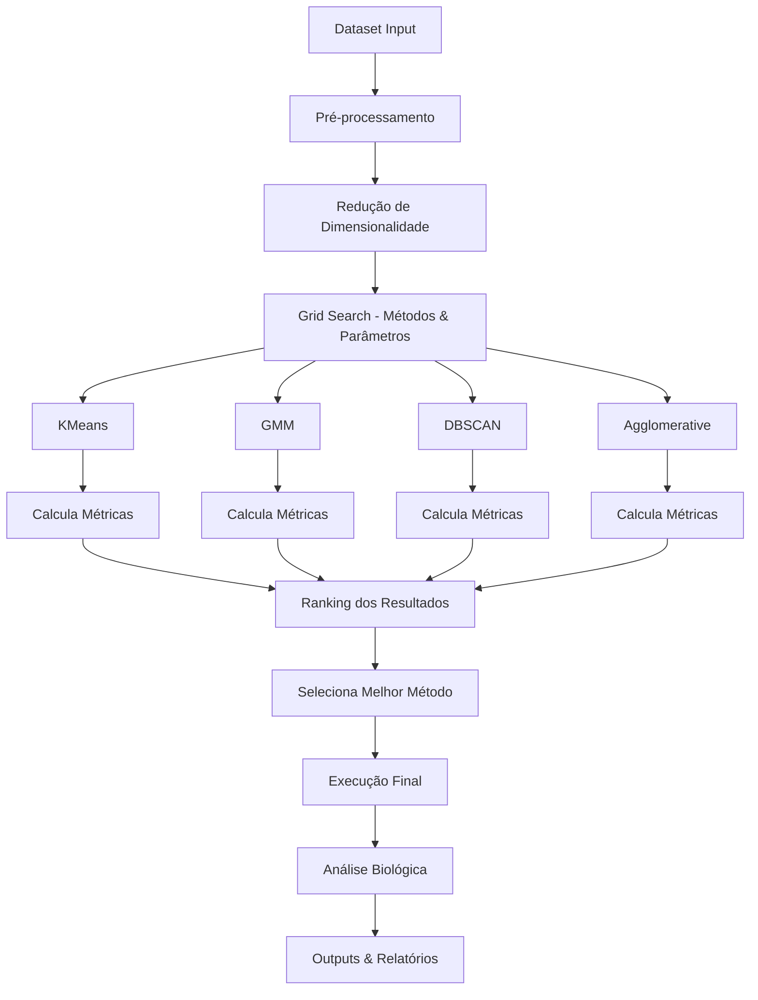
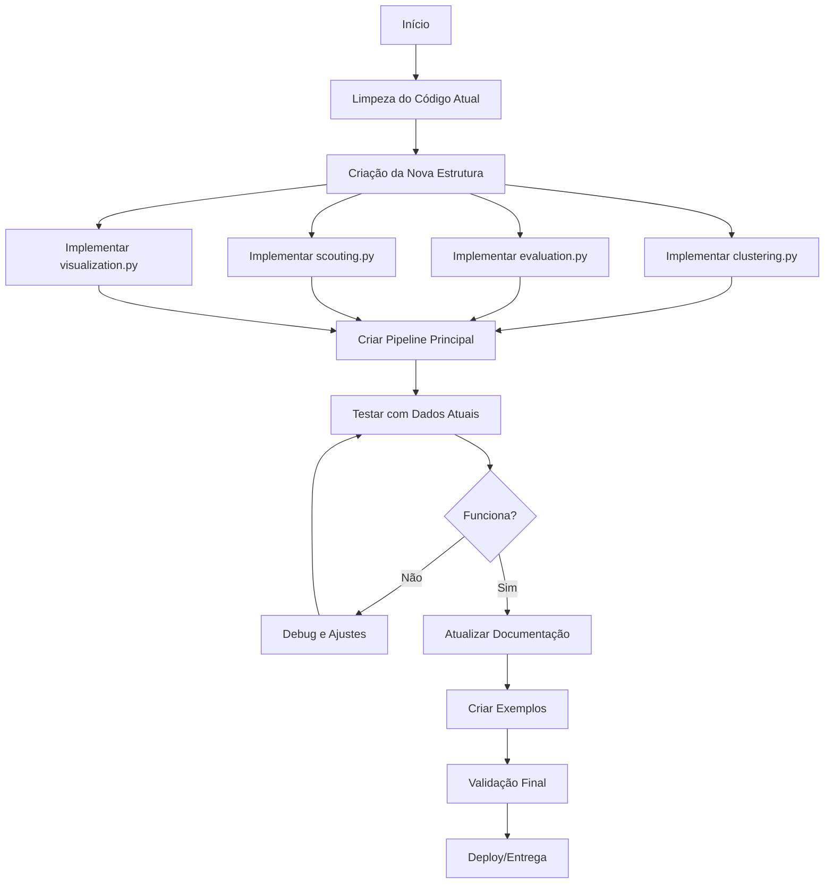

# Plano de Reorganização do Projeto K-mer ML

## Análise do Estado Atual

### Problemas Identificados no `test_ml_features.py`:
- **Código desorganizado**: Imports duplicados, lógica misturada
- **Sem scouting automático**: Testa métodos manualmente sem comparação sistemática
- **Outputs não organizados**: Gráficos e resultados espalhados
- **Sem integração com labels biológicos**: Não cruza clusters com famílias/gêneros
- **Código repetitivo**: Múltiplas chamadas similares de clustering

---

## 1. **Organização do Módulo ML com Scouting Automático**

### **Estrutura Proposta**

```
kmerml/ml/
├── __init__.py
├── clustering.py      # Wrappers para métodos de clustering
├── scouting.py        # Pipeline de scouting automático
├── evaluation.py      # Métricas de avaliação
├── visualization.py   # Funções de plotagem
└── utils.py          # Utilitários (normalização, etc.)
```

### **Fluxograma do Scouting Pipeline**



### **Implementação dos Módulos**

#### `kmerml/ml/clustering.py`
```python
from sklearn.cluster import KMeans, DBSCAN, AgglomerativeClustering
from sklearn.mixture import GaussianMixture
from typing import Dict, Any, List
import numpy as np

class ClusteringMethod:
    """Base class para métodos de clustering"""
    
    def __init__(self, name: str, estimator, param_grid: Dict[str, List]):
        self.name = name
        self.estimator = estimator
        self.param_grid = param_grid
    
    def fit_predict(self, X: np.ndarray, **params) -> np.ndarray:
        """Executa clustering com parâmetros específicos"""
        model = self.estimator(**params)
        return model.fit_predict(X)

def get_clustering_methods() -> Dict[str, ClusteringMethod]:
    """Retorna dicionário com todos os métodos de clustering disponíveis"""
    methods = {
        'kmeans': ClusteringMethod(
            name='KMeans',
            estimator=KMeans,
            param_grid={
                'n_clusters': [2, 3, 4, 5, 6, 7, 8],
                'random_state': [42]
            }
        ),
        'gmm': ClusteringMethod(
            name='GMM',
            estimator=GaussianMixture,
            param_grid={
                'n_components': [2, 3, 4, 5, 6, 7, 8],
                'random_state': [42]
            }
        ),
        'dbscan': ClusteringMethod(
            name='DBSCAN',
            estimator=DBSCAN,
            param_grid={
                'eps': [0.5, 1.0, 2.0, 3.0, 4.0, 5.0],
                'min_samples': [3, 5, 7, 10]
            }
        ),
        'agglomerative': ClusteringMethod(
            name='Agglomerative',
            estimator=AgglomerativeClustering,
            param_grid={
                'n_clusters': [2, 3, 4, 5, 6, 7, 8],
                'linkage': ['ward', 'complete', 'average']
            }
        )
    }
    return methods
```

#### `kmerml/ml/evaluation.py`
```python
from sklearn.metrics import silhouette_score, calinski_harabasz_score, davies_bouldin_score
import numpy as np
from typing import Dict, Any

def evaluate_clustering(X: np.ndarray, labels: np.ndarray) -> Dict[str, float]:
    """
    Calcula múltiplas métricas de avaliação para clustering
    
    Args:
        X: Dados originais
        labels: Labels dos clusters
        
    Returns:
        Dict com métricas calculadas
    """
    if len(set(labels)) < 2:
        return {
            'silhouette': -1.0,
            'calinski_harabasz': 0.0,
            'davies_bouldin': float('inf'),
            'n_clusters': len(set(labels)),
            'noise_points': sum(labels == -1) if -1 in labels else 0
        }
    
    # Remove pontos de ruído para métricas que não suportam
    mask = labels != -1
    X_clean = X[mask]
    labels_clean = labels[mask]
    
    if len(set(labels_clean)) < 2:
        return {
            'silhouette': -1.0,
            'calinski_harabasz': 0.0,
            'davies_bouldin': float('inf'),
            'n_clusters': len(set(labels)),
            'noise_points': sum(labels == -1)
        }
    
    return {
        'silhouette': silhouette_score(X_clean, labels_clean),
        'calinski_harabasz': calinski_harabasz_score(X_clean, labels_clean),
        'davies_bouldin': davies_bouldin_score(X_clean, labels_clean),
        'n_clusters': len(set(labels)),
        'noise_points': sum(labels == -1) if -1 in labels else 0
    }

def rank_results(results: list, primary_metric: str = 'silhouette') -> list:
    """
    Rankeia resultados por métrica primária
    
    Args:
        results: Lista de dicionários com resultados
        primary_metric: Métrica para ranking
        
    Returns:
        Lista ordenada por melhor resultado
    """
    if primary_metric == 'davies_bouldin':
        # Para Davies-Bouldin, menor é melhor
        return sorted(results, key=lambda x: x['metrics'][primary_metric])
    else:
        # Para silhouette e calinski_harabasz, maior é melhor
        return sorted(results, key=lambda x: x['metrics'][primary_metric], reverse=True)
```

#### `kmerml/ml/scouting.py`
```python
import itertools
from typing import Dict, List, Any, Optional
import numpy as np
import pandas as pd
from .clustering import get_clustering_methods
from .evaluation import evaluate_clustering, rank_results
from .visualization import plot_clustering_results

class ClusteringScout:
    """
    Classe principal para scouting automático de métodos de clustering
    """
    
    def __init__(self, methods: Optional[List[str]] = None):
        """
        Args:
            methods: Lista de métodos para testar. Se None, testa todos.
        """
        all_methods = get_clustering_methods()
        if methods is None:
            self.methods = all_methods
        else:
            self.methods = {k: v for k, v in all_methods.items() if k in methods}
    
    def scout(self, X: np.ndarray, output_dir: str = "data/results/") -> Dict[str, Any]:
        """
        Executa scouting completo de métodos de clustering
        
        Args:
            X: Dados para clustering
            output_dir: Diretório para salvar resultados
            
        Returns:
            Dicionário com melhor resultado e todos os resultados
        """
        all_results = []
        
        print(f"Iniciando scouting com {len(self.methods)} métodos...")
        
        for method_name, method in self.methods.items():
            print(f"Testando {method.name}...")
            
            # Gera todas as combinações de parâmetros
            param_combinations = [
                dict(zip(method.param_grid.keys(), values))
                for values in itertools.product(*method.param_grid.values())
            ]
            
            for params in param_combinations:
                try:
                    # Executa clustering
                    labels = method.fit_predict(X, **params)
                    
                    # Avalia resultado
                    metrics = evaluate_clustering(X, labels)
                    
                    # Armazena resultado
                    result = {
                        'method': method.name,
                        'method_key': method_name,
                        'params': params,
                        'labels': labels,
                        'metrics': metrics
                    }
                    all_results.append(result)
                    
                    print(f"  {params} -> Silhouette: {metrics['silhouette']:.3f}")
                    
                except Exception as e:
                    print(f"  Erro com {params}: {e}")
                    continue
        
        # Rankeia resultados
        ranked_results = rank_results(all_results)
        best_result = ranked_results[0] if ranked_results else None
        
        if best_result:
            print(f"\nMelhor resultado:")
            print(f"Método: {best_result['method']}")
            print(f"Parâmetros: {best_result['params']}")
            print(f"Silhouette: {best_result['metrics']['silhouette']:.3f}")
            print(f"Clusters: {best_result['metrics']['n_clusters']}")
        
        # Salva resultados
        self._save_results(all_results, ranked_results, output_dir)
        
        return {
            'best_result': best_result,
            'all_results': all_results,
            'ranked_results': ranked_results
        }
    
    def _save_results(self, all_results: List, ranked_results: List, output_dir: str):
        """Salva resultados em CSV"""
        import os
        os.makedirs(output_dir, exist_ok=True)
        
        # Converte para DataFrame
        data = []
        for result in all_results:
            row = {
                'method': result['method'],
                'params': str(result['params']),
                **result['metrics']
            }
            data.append(row)
        
        df = pd.DataFrame(data)
        df.to_csv(f"{output_dir}/clustering_scout_results.csv", index=False)
        
        # Salva ranking
        ranking_data = []
        for i, result in enumerate(ranked_results[:10]):  # Top 10
            row = {
                'rank': i + 1,
                'method': result['method'],
                'params': str(result['params']),
                **result['metrics']
            }
            ranking_data.append(row)
        
        df_rank = pd.DataFrame(ranking_data)
        df_rank.to_csv(f"{output_dir}/clustering_ranking.csv", index=False)
```

#### `kmerml/ml/visualization.py`
```python
import matplotlib.pyplot as plt
import seaborn as sns
import numpy as np
import pandas as pd
from typing import Optional, Dict, Any

def plot_clustering_results(X: np.ndarray, 
                          labels: np.ndarray,
                          method_name: str,
                          output_path: Optional[str] = None,
                          biological_labels: Optional[np.ndarray] = None) -> None:
    """
    Plota resultados de clustering
    
    Args:
        X: Dados (assumindo 2D após redução de dimensionalidade)
        labels: Labels dos clusters
        method_name: Nome do método
        output_path: Caminho para salvar
        biological_labels: Labels biológicos (família, etc.)
    """
    fig, axes = plt.subplots(1, 2 if biological_labels is not None else 1, 
                            figsize=(15, 6) if biological_labels is not None else (8, 6))
    
    if biological_labels is not None:
        axes = [axes] if not hasattr(axes, '__len__') else axes
        ax1, ax2 = axes[0], axes[1]
    else:
        ax1 = axes
    
    # Plot 1: Clusters
    scatter = ax1.scatter(X[:, 0], X[:, 1], c=labels, cmap='tab10', alpha=0.7)
    ax1.set_title(f"{method_name} Clustering")
    ax1.set_xlabel("Component 1")
    ax1.set_ylabel("Component 2")
    
    # Plot 2: Biological labels (se disponível)
    if biological_labels is not None:
        unique_labels = np.unique(biological_labels)
        colors = plt.cm.tab20(np.linspace(0, 1, len(unique_labels)))
        
        for label, color in zip(unique_labels, colors):
            mask = biological_labels == label
            ax2.scatter(X[mask, 0], X[mask, 1], c=[color], label=label, alpha=0.7)
        
        ax2.set_title("Biological Labels")
        ax2.set_xlabel("Component 1")
        ax2.set_ylabel("Component 2")
        ax2.legend(bbox_to_anchor=(1.05, 1), loc='upper left', fontsize='small')
    
    plt.tight_layout()
    
    if output_path:
        plt.savefig(output_path, dpi=300, bbox_inches='tight')
        plt.close()
    else:
        plt.show()

def plot_scout_summary(results: Dict[str, Any], output_dir: str):
    """
    Plota resumo dos resultados de scouting
    """
    all_results = results['all_results']
    
    # Extrai dados para plotting
    methods = [r['method'] for r in all_results]
    silhouette_scores = [r['metrics']['silhouette'] for r in all_results]
    n_clusters = [r['metrics']['n_clusters'] for r in all_results]
    
    fig, axes = plt.subplots(2, 2, figsize=(15, 12))
    
    # Plot 1: Silhouette por método
    df_plot = pd.DataFrame({'Method': methods, 'Silhouette': silhouette_scores})
    sns.boxplot(data=df_plot, x='Method', y='Silhouette', ax=axes[0, 0])
    axes[0, 0].set_title('Silhouette Score por Método')
    axes[0, 0].tick_params(axis='x', rotation=45)
    
    # Plot 2: Número de clusters por método
    df_plot2 = pd.DataFrame({'Method': methods, 'N_Clusters': n_clusters})
    sns.boxplot(data=df_plot2, x='Method', y='N_Clusters', ax=axes[0, 1])
    axes[0, 1].set_title('Número de Clusters por Método')
    axes[0, 1].tick_params(axis='x', rotation=45)
    
    # Plot 3: Top 10 resultados
    top_10 = results['ranked_results'][:10]
    top_methods = [r['method'] for r in top_10]
    top_scores = [r['metrics']['silhouette'] for r in top_10]
    
    axes[1, 0].barh(range(len(top_10)), top_scores)
    axes[1, 0].set_yticks(range(len(top_10)))
    axes[1, 0].set_yticklabels([f"{m} ({r['metrics']['n_clusters']} clusters)" 
                               for m, r in zip(top_methods, top_10)])
    axes[1, 0].set_xlabel('Silhouette Score')
    axes[1, 0].set_title('Top 10 Melhores Resultados')
    
    # Plot 4: Correlação entre métricas
    metrics_data = {
        'Silhouette': [r['metrics']['silhouette'] for r in all_results],
        'Calinski-Harabasz': [r['metrics']['calinski_harabasz'] for r in all_results],
        'Davies-Bouldin': [r['metrics']['davies_bouldin'] for r in all_results if r['metrics']['davies_bouldin'] != float('inf')]
    }
    
    df_corr = pd.DataFrame(metrics_data)
    sns.heatmap(df_corr.corr(), annot=True, ax=axes[1, 1])
    axes[1, 1].set_title('Correlação entre Métricas')
    
    plt.tight_layout()
    plt.savefig(f"{output_dir}/scout_summary.png", dpi=300, bbox_inches='tight')
    plt.close()
```

---

## 2. **Pipeline Geral Reorganizado**

### **Novo Script Principal: `scripts/run_pipeline.py`**

```python
#!/usr/bin/env python3
"""
Pipeline principal do K-mer ML com scouting automático
"""

import os
import argparse
import pandas as pd
import numpy as np
from kmerml.ml.features import KmerFeatureBuilderAgg
from kmerml.ml.dimensionality import reduce_dimensions
from kmerml.ml.scouting import ClusteringScout
from kmerml.ml.visualization import plot_clustering_results, plot_scout_summary

def load_biological_labels(labels_file: str, feature_index: pd.Index) -> pd.Series:
    """Carrega e alinha labels biológicos"""
    labels_df = pd.read_csv(labels_file, sep="\t", index_col=0)
    
    # Normaliza índices
    feature_index_clean = feature_index.str.replace(r'\.\d+$', '', regex=True)
    labels_df.index = labels_df.index.str.replace(r'\.\d+$', '', regex=True)
    
    # Alinha
    return labels_df.loc[feature_index_clean, "family"]

def analyze_biological_consistency(clusters: np.ndarray, 
                                 biological_labels: pd.Series,
                                 output_dir: str) -> None:
    """Analisa consistência entre clusters e labels biológicos"""
    df_analysis = pd.DataFrame({
        'cluster': clusters,
        'family': biological_labels.values
    })
    
    # Tabela cruzada
    crosstab = pd.crosstab(df_analysis['cluster'], df_analysis['family'])
    crosstab.to_csv(f"{output_dir}/cluster_family_crosstab.csv")
    
    # Conta famílias por cluster
    family_counts = df_analysis.groupby('cluster')['family'].value_counts()
    family_counts.to_csv(f"{output_dir}/family_counts_by_cluster.csv")
    
    print("Análise biológica salva em:")
    print(f"  - {output_dir}/cluster_family_crosstab.csv")
    print(f"  - {output_dir}/family_counts_by_cluster.csv")

def main():
    parser = argparse.ArgumentParser(description='K-mer ML Pipeline com Scouting')
    parser.add_argument('--stats-dir', default='data/processed/features',
                       help='Diretório com features calculadas')
    parser.add_argument('--output-dir', default='data/results/',
                       help='Diretório de saída')
    parser.add_argument('--labels-file', default='data/ncbi_dataset_all.tsv',
                       help='Arquivo com labels biológicos')
    parser.add_argument('--metrics', nargs='+', 
                       default=['gc_percent', 'gc_skew', 'unique_kmer_ratio', 
                               'palindrome_ratio', 'normalized_entropy'],
                       help='Métricas para usar')
    parser.add_argument('--agg-funcs', nargs='+', default=['mean'],
                       help='Funções de agregação')
    parser.add_argument('--methods', nargs='+', 
                       default=['kmeans', 'gmm', 'dbscan', 'agglomerative'],
                       help='Métodos de clustering para testar')
    parser.add_argument('--n-components', type=int, default=2,
                       help='Componentes para redução de dimensionalidade')
    parser.add_argument('--reduction-method', default='pca',
                       choices=['pca', 'umap'], help='Método de redução')
    
    args = parser.parse_args()
    
    # Cria diretório de saída
    os.makedirs(args.output_dir, exist_ok=True)
    
    print("=== K-mer ML Pipeline com Scouting ===")
    print(f"Stats dir: {args.stats_dir}")
    print(f"Output dir: {args.output_dir}")
    print(f"Métodos: {args.methods}")
    
    # 1. Carrega e processa features
    print("\n1. Carregando features...")
    builder = KmerFeatureBuilderAgg(stats_dir=args.stats_dir)
    feature_matrix = builder.build_aggregated_features(
        metrics=args.metrics,
        agg_funcs=args.agg_funcs,
        n_jobs=-1
    )
    feature_matrix_std = builder.standardize_features()
    print(f"   Features shape: {feature_matrix_std.shape}")
    
    # 2. Redução de dimensionalidade
    print(f"\n2. Redução de dimensionalidade ({args.reduction_method})...")
    X_reduced = reduce_dimensions(
        feature_matrix_std, 
        method=args.reduction_method, 
        n_components=args.n_components
    )
    np.savetxt(f"{args.output_dir}/X_{args.reduction_method}.csv", 
               X_reduced, delimiter=",")
    
    # 3. Carrega labels biológicos (se disponível)
    biological_labels = None
    if os.path.exists(args.labels_file):
        print("\n3. Carregando labels biológicos...")
        try:
            biological_labels = load_biological_labels(
                args.labels_file, feature_matrix_std.index
            )
            print(f"   Labels carregados: {len(biological_labels)} amostras")
        except Exception as e:
            print(f"   Erro ao carregar labels: {e}")
    
    # 4. Scouting de clustering
    print("\n4. Executando scouting de clustering...")
    scout = ClusteringScout(methods=args.methods)
    scout_results = scout.scout(X_reduced, args.output_dir)
    
    # 5. Análise do melhor resultado
    print("\n5. Analisando melhor resultado...")
    best_result = scout_results['best_result']
    
    if best_result:
        # Plota melhor resultado
        plot_clustering_results(
            X_reduced,
            best_result['labels'],
            f"{best_result['method']} (Best)",
            f"{args.output_dir}/best_clustering.png",
            biological_labels.values if biological_labels is not None else None
        )
        
        # Análise biológica
        if biological_labels is not None:
            analyze_biological_consistency(
                best_result['labels'],
                biological_labels,
                args.output_dir
            )
        
        # Plota resumo do scouting
        plot_scout_summary(scout_results, args.output_dir)
        
        # Salva resultado final
        final_results = pd.DataFrame({
            'sample_id': feature_matrix_std.index,
            'cluster': best_result['labels']
        })
        
        if biological_labels is not None:
            final_results['family'] = biological_labels.values
            
        final_results.to_csv(f"{args.output_dir}/final_clusters.csv", index=False)
        
        print(f"\nResultados salvos em: {args.output_dir}")
        print("Arquivos gerados:")
        print("  - clustering_scout_results.csv (todos os resultados)")
        print("  - clustering_ranking.csv (top 10)")
        print("  - best_clustering.png (visualização)")
        print("  - scout_summary.png (resumo)")
        print("  - final_clusters.csv (clusters finais)")
        
        if biological_labels is not None:
            print("  - cluster_family_crosstab.csv (análise biológica)")
            print("  - family_counts_by_cluster.csv")

if __name__ == "__main__":
    main()
```

---

## 3. **Documentação e Organização**

### **README.md Atualizado**

```markdown
# K-mer ML: Machine Learning para Análise de K-mers

## Visão Geral

Pipeline automatizado para análise de k-mers usando machine learning, com scouting automático para encontrar o melhor método de clustering para seus dados.

## Instalação

```bash
git clone <repo>
cd kmer-ml
pip install -e .
```

## Uso Rápido

```bash
# Pipeline completo com scouting automático
python scripts/run_pipeline.py

# Com parâmetros personalizados
python scripts/run_pipeline.py \
  --methods kmeans gmm \
  --metrics gc_percent gc_skew \
  --reduction-method umap
```

## Módulos

- **kmerml.ml.scouting**: Pipeline automático de scouting
- **kmerml.ml.clustering**: Métodos de clustering
- **kmerml.ml.evaluation**: Métricas de avaliação
- **kmerml.ml.visualization**: Plotagem de resultados

## Outputs

O pipeline gera automaticamente:
- Ranking de métodos testados
- Visualizações dos melhores clusters
- Análise cruzada com labels biológicos
- Relatórios de performance

## Estrutura de Arquivos

```
data/results/
├── clustering_scout_results.csv    # Todos os resultados
├── clustering_ranking.csv          # Top 10 métodos
├── best_clustering.png            # Visualização melhor resultado
├── scout_summary.png              # Resumo do scouting
└── final_clusters.csv             # Clusters finais
```
```

### **Documentação dos Módulos (`docs/`)**

#### `docs/scouting.md`
```markdown
# Scouting Automático

## Como Funciona

O módulo de scouting testa automaticamente diferentes métodos de clustering com múltiplos parâmetros e rankeia os resultados usando métricas objetivas.

## Métodos Suportados

- **KMeans**: Clustering baseado em centróides
- **GMM**: Gaussian Mixture Models
- **DBSCAN**: Clustering baseado em densidade
- **Agglomerative**: Clustering hierárquico

## Métricas de Avaliação

- **Silhouette Score**: Qualidade da separação dos clusters
- **Calinski-Harabasz**: Razão entre dispersão intra e inter-cluster
- **Davies-Bouldin**: Similaridade média entre clusters

## Adicionando Novos Métodos

1. Implemente o método em `clustering.py`
2. Adicione ao dicionário em `get_clustering_methods()`
3. Defina grid de parâmetros apropriado
```

---

## 4. **Fluxograma de Ação Completo**



## 5. **Cronograma de Implementação**

### **Dia 1-2: Limpeza e Estruturação**
- [ ] Remover código duplicado e arquivos antigos
- [ ] Criar nova estrutura de diretórios
- [ ] Implementar módulos base (clustering.py, evaluation.py)

### **Dia 3-4: Scouting e Visualização**
- [ ] Implementar scouting.py completo
- [ ] Criar visualization.py com plots automáticos
- [ ] Integrar análise biológica

### **Dia 5: Pipeline e Documentação**
- [ ] Criar script principal (run_pipeline.py)
- [ ] Testar com dados reais
- [ ] Escrever documentação completa

### **Dia 6: Validação e Entrega**
- [ ] Testes finais
- [ ] Otimizações de performance
- [ ] Entrega da versão final

Este plano reorganiza completamente o projeto, criando um pipeline robusto, modular e bem documentado que automaticamente encontra o melhor método de clustering para qualquer dataset.